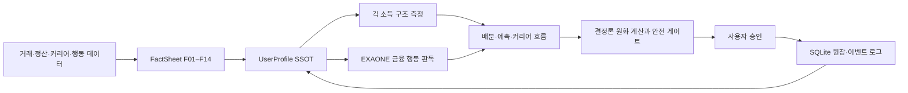

<p align="center">
  
</p>

<h1 align="center">커리어 저금통</h1>

<p align="center">
  <strong>당신이 ‘한 일’이, 당신의 자산이 됩니다.</strong><br>
  개발자·디자이너·크리에이터 등 긱워커를 위한 AI 생활금융 플랫폼
</p>

하나은행 청년 금융인재 공모전 AI·블록체인 트랙 결선작입니다. 흩어진 일감과 정산 이력을 모으고, 불규칙한 입금이 들어올 때마다 필요한 돈을 봉투로 나누어 제안하며, 소득 흐름에 맞춘 은퇴 준비와 하나금융 상품 연결까지 지원합니다.

## 서비스가 해결하는 문제

| 생애주기 | 긱워커의 문제 | 커리어 저금통의 대응 |
|---|---|---|
| 초창기 | 재직증명서 없이 일의 연속성과 경력을 설명하기 어렵다 | 플랫폼·홈택스·협회·정산 내역을 연결해 커리어 이력을 정리하고, 사용자가 확인한 일감을 누적한다 |
| 완숙기 | 이번 달 700만 원, 다음 달 0원처럼 소득이 불규칙해 월급 기준 예산 관리가 깨진다 | 입금 건마다 세금·경비·생활비·안전자금·목표자금의 순차 배분을 제안한다 |
| 은퇴기 | 정년과 퇴직금이 없어 언제까지 일할지, 언제 그만둘 수 있을지 알기 어렵다 | 소득 소멸형과 자금 달성형 두 은퇴 곡선을 함께 제시하고 연금 준비로 연결한다 |

## 핵심 기능

### 1. 커리어 이력 관리

- 거래·정산 내역을 분류하되, 애매하거나 고액인 입금은 자동 확정하지 않고 사용자에게 확인합니다.
- 마이데이터·홈택스·KOSA 등 여러 출처를 교차해 검증 비용을 높이고, 공모 가능성은 잔존위험으로 남깁니다.
- 커리어 점수는 이식 가능한 평판 신호이며, 대출 한도·금리·승인 여부를 계산하지 않습니다.
- 검증된 일감과 관리 행동은 커리어 저금통 XP·레벨로 보상하지만 금융 판단에는 사용하지 않습니다.

### 2. AI 예산 플래너

- 거래·정산 원장에서 `F01–F14` FactSheet를 만들고, 단일 `UserProfile`에서 소득 구조와 금융 행동을 합성합니다.
- 세금과 합계는 결정론으로 계산하고, AI는 페르소나 판독·봉투 추천·금액 페이싱의 우선순위를 판단합니다.
- 세금 → 경비 → 생활비 → 안전자금 → 목표자금 순서를 지키며, 실제 잔액 이동은 승인 후에만 일어납니다.
- 사용자의 승인·조정·거절은 이벤트 로그에 남아 다음 분류와 개인화 제안을 보정합니다.

### 3. 소득·은퇴 예측

- 플랫폼 정산, 반복 발주처, 착수금→잔금, 신규 일감을 별도 소득 스트림으로 분해합니다.
- 다음 수입을 하나의 날짜가 아니라 `P10–P90` 구간으로 보여줍니다.
- 은퇴를 `소득이 생활비 아래로 내려가는 시점`과 `필요 자금을 모아 그만둘 수 있는 시점`으로 나누어 계산합니다.

### 4. 하나금융 상품 연결

- 부적합 상품은 결정론 적합성 veto로 먼저 제외합니다.
- 로컬 EXAONE이 남은 하나금융 상품 후보 중 최대 2개를 선택하고 근거를 제시합니다.
- 자격·한도·금리·승인은 생성하지 않으며 하나원큐의 실제 심사 단계로 연결합니다.

## 기술 구조



설계 문법은 다음 네 문장으로 요약됩니다.

> 판단은 AI · 원화는 산수 · 방향은 원칙 · 폴백은 공식

- 로컬 AI: Ollama + EXAONE 3.5. 외부 AI API를 사용하지 않습니다.
- 판단 모델: 2.4B는 분류·질문·이벤트 파싱·라우팅, 7.8B는 페르소나·봉투·페이싱·상품·코치에 사용합니다.
- 역할 분리: `GET /v1/agents`에서 10개 판단 역할과 각 가드레일·폴백을 확인할 수 있습니다.
- 계층 강제: `core → engines/profile/agents → orchestration → api` 의존 방향을 테스트가 검증합니다.
- 영속성: SQLite에 거래, 봉투 잔액, 배분 제안, 사용자 결정, 프로필 스냅샷, 이벤트를 저장합니다.

자세한 내용은 [ARCHITECTURE.md](ARCHITECTURE.md)와 [AI_FEATURES.md](AI_FEATURES.md)를 참고하십시오.

## 측정된 AI

페르소나 판독은 13개 페르소나·22개 축 라벨의 골든셋으로 측정했습니다.

| 대조군 | 정확도 | 방향오류 | 과신 | 안전기권 |
|---|---:|---:|---:|---:|
| 나이브 단일 규칙 | 90.9% | 1 | 0 | 1 |
| EXAONE 7.8B + 게이트 | 63.6% | 0 | 0 | 8 |

원시 정확도로 AI가 규칙을 이긴다고 주장하지 않습니다. 이 실험의 핵심은 근거 인용·번호 선택·방향 검증 게이트가 확신 오판을 중립 기권으로 바꾸어 `low ↔ high` 방향오류를 0건으로 만든 점입니다. 전체 실행 기록은 [apps/api/evals/RESULTS.md](apps/api/evals/RESULTS.md)에 있습니다.

## 기술 스택

| 영역 | 기술 |
|---|---|
| 모바일·웹 데모 | Expo 52, React Native, TypeScript, Expo Router |
| API | FastAPI, Python 3.11, Pydantic |
| 데이터 | SQLite |
| 로컬 AI | Ollama, EXAONE 3.5 2.4B·7.8B |
| 품질 | pytest, Ruff, TypeScript typecheck, GitHub Actions |

## 저장소 구조

```text
Career-Piggybank/
├── apps/
│   ├── api/                 FastAPI, 결정론 엔진, AI 에이전트, 평가 하네스
│   └── mobile/              Expo 기반 모바일·웹 데모
├── docs/
│   ├── assets/              README 및 문서 이미지
│   └── career-piggybank-levels.md
├── packages/shared/         공용 타입·상수 확장 자리
├── AI_FEATURES.md           AI 역할·모델·가드레일·구현 상태
└── ARCHITECTURE.md          계층·데이터 흐름·엔진·API 계약
```

## 실행

### 1. 로컬 LLM

Ollama를 실행하고 `apps/api/app/core/config.py`의 기본 EXAONE 2.4B·7.8B 모델을 준비합니다. 필요하면 `OLLAMA_MODEL_JUDGMENT`, `OLLAMA_MODEL_COACH` 환경변수로 교체할 수 있으며 외부 모델 API 키는 필요하지 않습니다.

### 2. API

```bash
cd apps/api
python3 -m venv .venv
source .venv/bin/activate
pip install -e ".[dev]"
uvicorn app.main:app --reload
```

API 문서는 `http://localhost:8000/docs`에서 확인할 수 있습니다. `demo_seed=true`이면 시작 시 조대흠 데모 데이터가 자동으로 생성됩니다.

### 3. 모바일·웹 데모

```bash
cd apps/mobile
npm install
npm start
```

루트에서는 `make api`, `make api-test`, `make mobile`, `make lint`를 사용할 수 있습니다.

## 검증

```bash
cd apps/api
ruff check .
pytest -q

cd ../../apps/mobile
npm run lint
```

로컬 Ollama가 필요한 골든셋 실측은 CI와 분리되어 있습니다.

```bash
cd apps/api
python -m evals.run_persona_eval --llm
```

## 팀

서강대학교 팀 짱사이트 — 구준모, 권유철, 조대흠, 한민영

## 기여

버그 제보나 제안은 GitHub Issues로 남겨주십시오.
